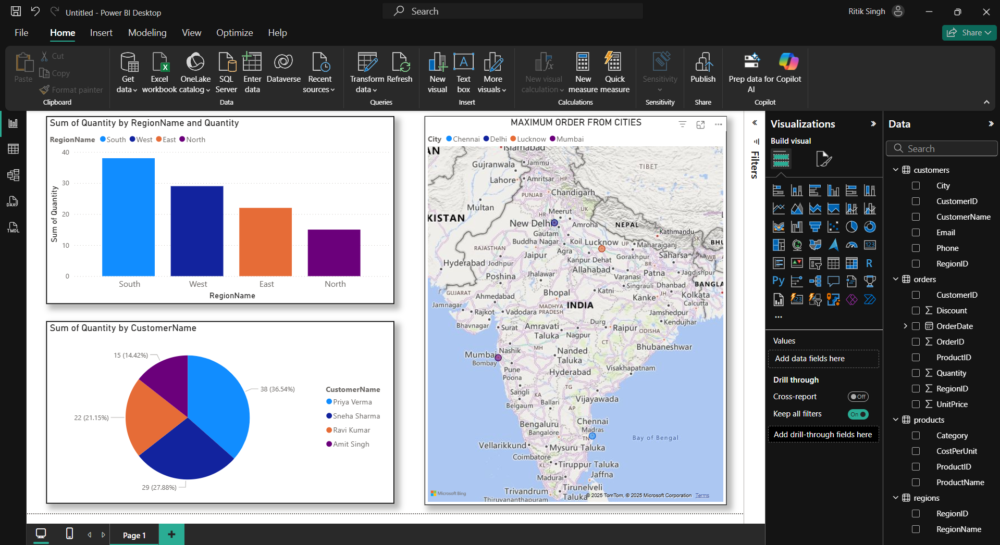

# SQL + Power BI Sales Analysis

This project demonstrates how to perform **end-to-end sales data analysis** using **MySQL** as the database and **Power BI** for data visualization.

---

## 🚀 Project Overview
- **Database:** MySQL  
- **Dataset:** Sales orders (demo data with regions, products, and discounts)  
- **Visualization Tool:** Power BI  
- **Goal:** To analyze sales performance and create interactive dashboards for insights.

---

## 📂 Project Structure  

```SQL_PowerBI_Sales-analysis/
│── SQL/
│ └── salesdb.sql # Schema + sample data + queries
│
│── PowerBI/
│ └── Sales_Dashboard.pbix # Interactive Power BI report
│
│── Screenshots/
│ ├── sales_region.png
│ ├── profit_trend.png
│
│── README.md
```
---

## 📊 Key Features
- Created a **relational database** with `Regions`, `Products`, and `Orders` tables.  
- Performed **data transformations** (discounts, revenue calculations, etc.).  
- Built **interactive Power BI dashboards** with:
  - Sales by Region  
  - Top-selling Products  
  - Monthly Trends  
  - Revenue & Discount Analysis  

---

## ⚡ Insights
- Identified **high-performing regions**.  
- Compared **year-over-year sales growth**.  
- Analyzed **discount impact** on revenue.  

---

## 🛠️ Tools & Technologies
- **MySQL** – Database & queries  
- **Power BI** – Visualizations  
- **GitHub** – Project version control  

---

## 📸 Sample Dashboard
### Sales by Region


---

## 🔒 Notes
- All data used is **dummy/demo data** for educational purposes.  
- No real customer or business information is exposed.  

---

## 👨‍💻 Author
- **Ritik Singh**  
- GitHub: [Unicorn2700](https://github.com/Unicorn2700)  


## ⭐ Contribute
Feel free to fork this repo, suggest improvements, or open pull requests!
